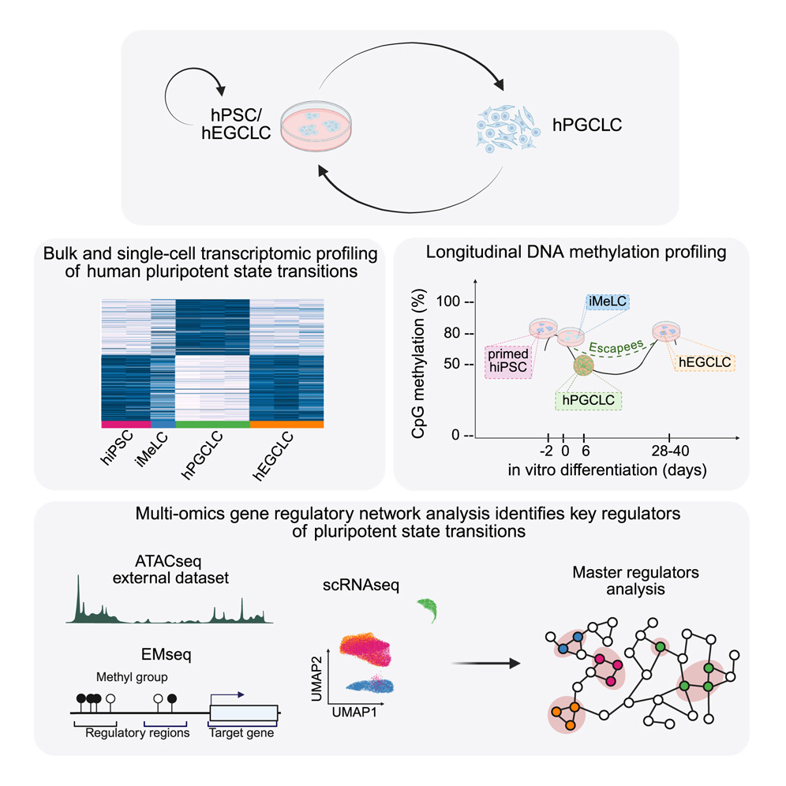

# Repository with the code to reproduce all the analyses of the paper _High resolution multi-scale profiling of embryonic germ cell-like cell derivation reveals pluripotent state transitions in humans_

**Sarah Stucchi, Lessly P. Sepulveda-Rincon, Camille Dion, Gaja Matassa, Alessia Valenti, Cristina Cheroni, Alessandro Vitriolo, Filippo Prazzoli, George Young, Marco Tullio Rigoli, Riccardo Nagni, Martina Ciprietti, Benedetta Muda, Zoe Heckhausen, Petra Hajkova, Nicolò Caporale, Giuseppe Testa, Harry G. Leitch**

  

This repository contains all the code used to analyze the single-cell RNA sequencing (scRNAseq), DNA methylation (EMseq) and bulk RNA sequencing (bulkRNAseq) data for the paper [High resolution multi-scale profiling of embryonic germ cell-like cell derivation reveals pluripotent state transitions in humans](https://doi.org/10.1016/j.stemcr.2025.102746).

Docker images: 
- for most of the scRNAseq analyses (notebooks in [scRNASeq folder](scRNASeq) from 00 to 05) can be retrieved via `docker pull alessiavalenti/transgenerationalhub:transgenerational-1.1.7`.
- for the analyses of DNA methylation data (Rmarkdown in [EMSeq folder](EMSeq)) can be retrieved via `docker pull testalab/downstream:Transgenerational-1.1.5`.
- for the analysis of bulkRNAseq data, R and package versions are available for reproducibility at the end of the html available in [bulkRNASeq folder](bulkRNASeq).

Html versions of all the notebooks are accessible [here](https://GiuseppeTestaLab.github.io/EGCLC_paper_release/).
